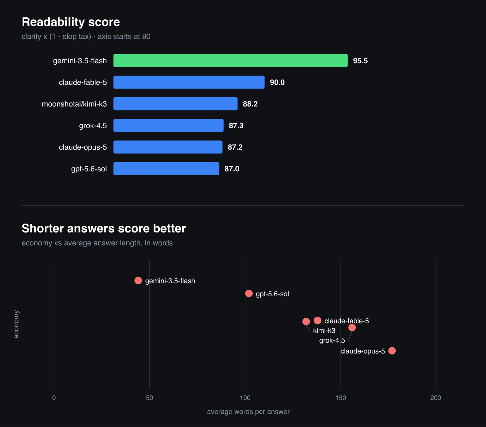

# readability-eval

A readability evaluation benchmark.

Scores model output on six clarity rules, minus a penalty for AI slop. Runs on OpenRouter, so you can score any model in one command.

```
Score = clarity x (1 - slop tax)
```

## Results

| Score | Model | Slop/1k | Words | Economy |
|:---:|---|---:|---:|---:|
| 🥇 **95.5** | `gemini-3.5-flash` | 0.0 | 44 | 8.3 |
| 🥈 **90.0** | `claude-fable-5` | 1.1 | 138 | 6.4 |
| 🥉 **88.2** | `moonshotai/kimi-k3` | 3.5 | 132 | 6.4 |
| **87.3** | `grok-4.5` | 1.9 | 156 | 6.1 |
| **87.2** | `claude-opus-5` | 0.3 | 177 | 5.0 |
| **87.0** | `gpt-5.6-sol` | 5.6 | 102 | 7.7 |

12 prompts per model, judged by `gemini-3.5-flash`.



**Length is the whole story.** Every model scored 10.0 on understandability and near-perfect on filler. Frontier models have largely stopped saying `delve`. What separates them is economy, and it tracks word count almost exactly: 44 words for first place, 177 for fifth. The remaining slop problem is volume, not vocabulary.

Full per-prompt scores in [`results/`](results/). Methodology and known limits in [METHODOLOGY.md](METHODOLOGY.md).

## The six rules

From Orwell's *Politics and the English Language*. Each scored 0-10.

| # | Rule | Scored by |
|---|------|-----------|
| 1 | Easy to understand? | Judge, relative to a declared audience |
| 2 | Fewer words rather than more? | Words per fact delivered |
| 3 | Avoids jargon and acronyms? | Undefined acronyms per 100 words |
| 4 | Would imagery make it clearer? | Judge, must name the image it wanted |
| 5 | Complex phrases instead of simple words? | `utilize`→`use`, `in order to`→`to` |
| 6 | Filler, pretentious diction, euphemism? | Three counters, euphemism weighted 3x |

Rules 2, 3, 5, 6 are deterministic counters. Rules 1 and 4 use a judge that must quote its evidence.

**Rule 2 is the one that bites.** Scored as raw brevity it crowns the emptiest answer, so every prompt ships a checklist of facts a complete answer must deliver. You cannot win by saying less.

## Slop detection

Three layers. A word list alone catches maybe half.

| Layer | Catches |
|---|---|
| 173 terms | `delve`, `testament to`, `boasts`, `great question`, `headwinds` |
| 12 patterns | `It's not X. It's Y.` · `not just X, but Y` · `serves as` |
| Shape | em dashes, sentence-length variance, fragment ratio, bold density |

Sources: [Wikipedia's Signs of AI writing](https://en.wikipedia.org/wiki/Wikipedia:Signs_of_AI_writing), the [humanizer](https://github.com/blader/humanizer) pattern set, a personal kill list.

## Run it

```bash
git clone https://github.com/exiao/readability-eval
cd readability-eval
export OPENROUTER_API_KEY=sk-or-...

python3 -m readability_eval.run --model anthropic/claude-sonnet-4.5
python3 -m readability_eval.report
```

Standard library only. A full run is 12 prompts plus 12 judge calls, a few cents on a cheap judge.

Use a judge from a different family than the model under test, and verify with `rejudge.py`.

## License

Apache 2.0.
